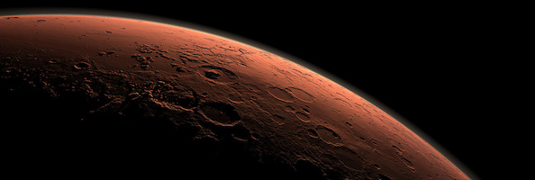
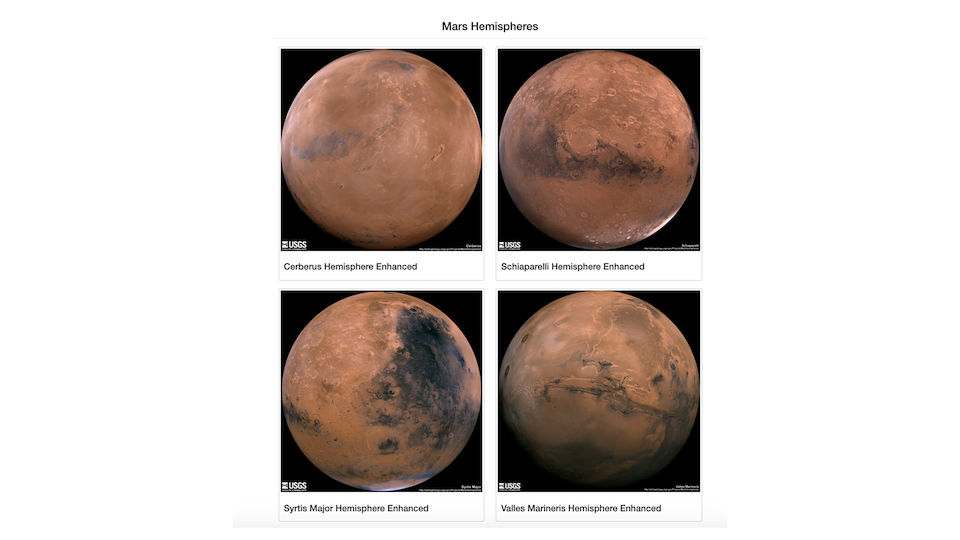
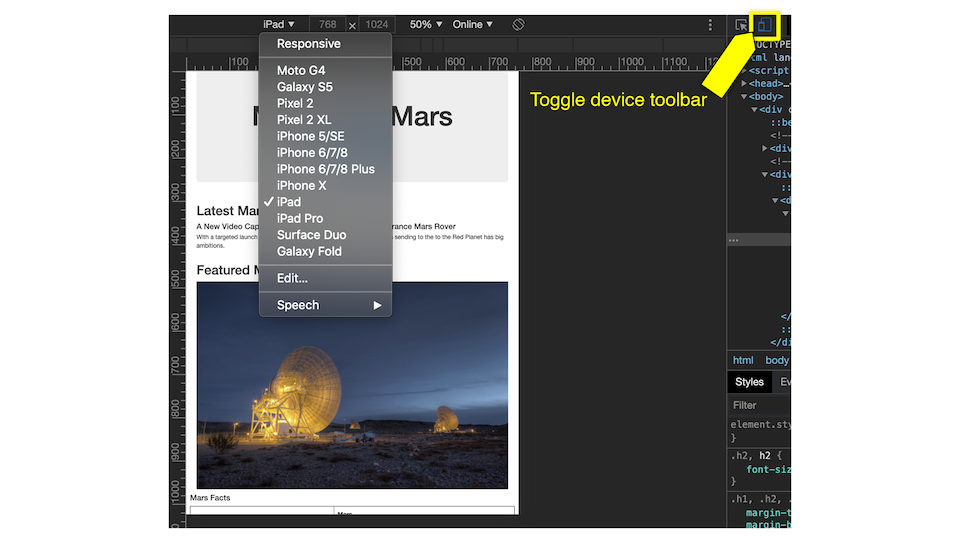

## Project Overview
Using BeautifulSoup and Splinter to scrape full-resolution images of Mars’s hemispheres and the titles of those images, store the scraped data on a Mongo database, use a web application to display the data, and alter the design of the web app to accommodate these images.

## Resources 
- **Data Source:** [NASA news](https://mars.nasa.gov/news/?page=0&per_page=40&order=publish_date+desc%2Ccreated_at+desc&search=&category=19%2C165%2C184%2C204&blank_scope=Latest) website, [Mars Hemispheres](https://astrogeology.usgs.gov/search/results?q=hemisphere+enhanced&k1=target&v1=Mars) website, [getbootstrap](https://getbootstrap.com/docs/4.0/components/alerts/) website 
- **Software:** BeautifulSoup, Splinter, MongoDB, Flask, Python, Jupyter notebook  

## Objectives
- Use BeautifulSoup and Splinter to automate a web browser and scrape high-resolution images.
- Use a MongoDB database to store data from the web scrape. 
- Update the web application and Flask to display the data from the web scrape.
- Use Bootstrap to style the web app.

## Mars Hemispheres

- Using BeautifulSoup and Splinter to scrape full-resolution images of Mars’s hemispheres and the titles of those images.

## Using DevTools 

- Using DevTools to test the responsiveness of our website

